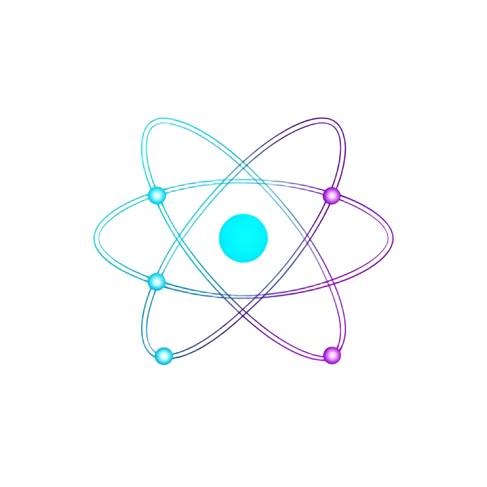

<div align="center">



# Planck Academy

**Tutor de Física Teórica com IA — adaptativo, em tempo real e com equações em LaTeX**

[](https://www.python.org/)
[](https://fastapi.tiangolo.com/)
[](https://ai.google.dev/)
[](https://katex.org/)
[](#licença)

[Demo](#-demo) · [Recursos](#-recursos) · [Quickstart](#-quickstart) · [API](#-api) · [Documentação completa](src/DOCUMENTATION.md)

</div>

---

## ✨ Sobre

**Planck Academy** é um web app educacional onde **Planck**, um tutor de IA, ensina Física Teórica de forma adaptativa. Escolha seu nível — **Iniciante**, **Intermediário** ou **Avançado** — e mergulhe em mecânica quântica, relatividade, cosmologia e mais. As respostas chegam em **streaming token a token**, estruturadas em quatro seções (**Conceito · Intuição · Matemática · Exemplo**), com equações renderizadas em LaTeX via KaTeX.

> ⚛️ *"A natureza ama esconder-se."* — Heráclito (e provavelmente os físicos teóricos também)

---

## 🎯 Recursos

| | |
|---|---|
| 🧠 **Tutor adaptativo** | 3 níveis de profundidade — do leigo ao avançado |
| ⚡ **Streaming SSE** | Respostas aparecem token a token, com cursor piscante |
| 🧮 **LaTeX nativo** | Equações renderizadas com KaTeX (`$...$` inline e `$$...$$` bloco) |
| 📚 **6 módulos prontos** | Mecânica Quântica, Relatividade, Termodinâmica, TQC, Cosmologia, Partículas |
| 🎲 **Quiz interativo** | 3 perguntas de múltipla escolha geradas dinamicamente sobre o último tópico |
| 🎨 **UI sci-fi minimalista** | Tema escuro, paleta ciano/violeta, tipografia Orbitron + IBM Plex Mono |
| 📱 **Responsivo** | Sidebar colapsável com hambúrguer no mobile |
| 🪶 **Zero build step** | Frontend é HTML/CSS/JS puro — sem Node, sem webpack |

---

## 🛠️ Stack

**Backend** — Python 3.10+ · FastAPI · `google-generativeai` (Gemini 2.0 Flash) · uvicorn
**Frontend** — HTML5 · CSS3 · JavaScript ES2022 puro · KaTeX 0.16.9 (CDN) · Google Fonts (Orbitron, IBM Plex Mono)

---

## 📁 Estrutura

```
src/
├── backend/
│   ├── main.py              # FastAPI: /api/chat, /api/chat/stream, /api/quiz
│   ├── requirements.txt
│   └── .env.example
├── frontend/
│   ├── index.html
│   ├── style.css
│   └── app.js
├── assets/
│   └── planck-logo.png
└── DOCUMENTATION.md         # 📘 Documentação completa
```

---

## 🚀 Quickstart

### 1. Pré-requisitos
- Python **3.10+**
- Uma chave **GEMINI_API_KEY** — pegue grátis em [Google AI Studio](https://aistudio.google.com/apikey)

### 2. Backend

```bash
cd src/backend

# Cria e ativa venv
python3 -m venv venv
source venv/bin/activate           # macOS / Linux
# venv\Scripts\activate            # Windows

# Instala dependências
pip install -r requirements.txt

# Configura a chave
cp .env.example .env               # depois edite e cole sua chave

# Sobe o servidor
uvicorn main:app --reload --port 8000
```

Servidor rodando em **http://localhost:8000** ✅

### 3. Frontend

Em **outro terminal**:

```bash
cd src/frontend
python3 -m http.server 5500
```

Abra **http://localhost:5500** no navegador. Pronto! 🎉

> 💡 Alternativa: extensão **Live Server** do VS Code, ou abra `index.html` direto (alguns navegadores bloqueiam SSE em `file://` — prefira o servidor estático).

---

## 🎬 Demo

1. Selecione um **nível** no topo (ex: *Iniciante*).
2. Clique em um módulo na sidebar (ex: *Mecânica Quântica → Equação de Schrödinger*).
3. Veja Planck responder em tempo real:
   - **Conceito** — definição clara
   - **Intuição** — analogia do cotidiano
   - **Matemática** — equações em LaTeX renderizadas
   - **Exemplo** — caso resolvido
4. Clique em **"Me teste"** para um quiz interativo sobre o último tópico.

---

## 🔌 API

Base URL: `http://localhost:8000`

| Método | Endpoint | Descrição |
|---|---|---|
| `GET`  | `/` | Health-check |
| `POST` | `/api/chat` | Chat não-streaming (fallback JSON) |
| `GET`  | `/api/chat/stream?payload=<base64>` | ⚡ **Streaming SSE** (usado pela UI) |
| `POST` | `/api/quiz` | Gera 3 perguntas de múltipla escolha |

### Exemplo — chat
```json
POST /api/chat
{
  "messages": [{ "role": "user", "content": "Explique entropia" }],
  "level": "Iniciante"
}
```
```json
{ "reply": "**Conceito** ... **Matemática** $S = k_B \\ln \\Omega$ ..." }
```

### Exemplo — stream SSE
```
event: chunk
data: "**Conceito** "

event: chunk
data: "Entropia mede a desordem..."

event: done
data: {}
```

📘 **Referência completa de API + arquitetura** → [`src/DOCUMENTATION.md`](src/DOCUMENTATION.md)

---

## 🎨 Design

| Token | Valor |
|---|---|
| Fundo | `#08090f` com grade sutil |
| Superfície | `#0d0e1a` (Planck) · `#1a1b2e` (usuário) |
| Primária (ciano) | `#00f5ff` |
| Secundária (roxo) | `#7c3aed` |
| Títulos | **Orbitron** |
| Corpo | **IBM Plex Mono** |

Animações: `glow-pulse` no avatar átomo enquanto carrega, `caret-blink` no cursor `▍` durante streaming, três pontos pulsantes antes do primeiro chunk.

---

## 🩺 Solução de problemas

| Sintoma | Solução |
|---|---|
| `Não foi possível conectar ao servidor` | Backend não está rodando — confira o terminal do uvicorn |
| `Erro do servidor: ...401` | `GEMINI_API_KEY` inválida — verifique o `.env` |
| `ModuleNotFoundError` | venv não ativado ou faltou `pip install -r requirements.txt` |
| Equações aparecem como `$x^2$` cru | Sem internet — KaTeX é carregado via CDN |
| CORS error no console | Confirme `allow_origins=["*"]` em `main.py` (dev) |

Mais soluções → [DOCUMENTATION.md → Troubleshooting](src/DOCUMENTATION.md#15-solução-de-problemas)

---

## 🗺️ Roadmap

- [ ] Persistência local (`localStorage`) para histórico
- [ ] Markdown rico (negrito, listas, syntax highlighting)
- [ ] Botão "Parar geração" (cancela o stream)
- [ ] Exportar conversa em Markdown/PDF
- [ ] Modo "Derivação passo a passo"
- [ ] Dockerização (`Dockerfile` + `docker-compose.yml`)
- [ ] Migração do backend para Edge Function (Lovable Cloud)

---

## 📄 Licença

MIT — uso livre para fins educacionais e comerciais. Veja o repositório para o texto completo.

**Tecnologias e fontes:**
- [Google Gemini](https://ai.google.dev/) — sujeito aos termos do Google AI
- [KaTeX](https://katex.org/) — MIT
- [Orbitron](https://fonts.google.com/specimen/Orbitron) e [IBM Plex Mono](https://fonts.google.com/specimen/IBM+Plex+Mono) — Open Font License

---

<div align="center">

**Construído com ⚛️ por entusiastas de física e IA.**

*Se este projeto te ajudou a entender algo novo, considere dar uma ⭐.*

</div>
